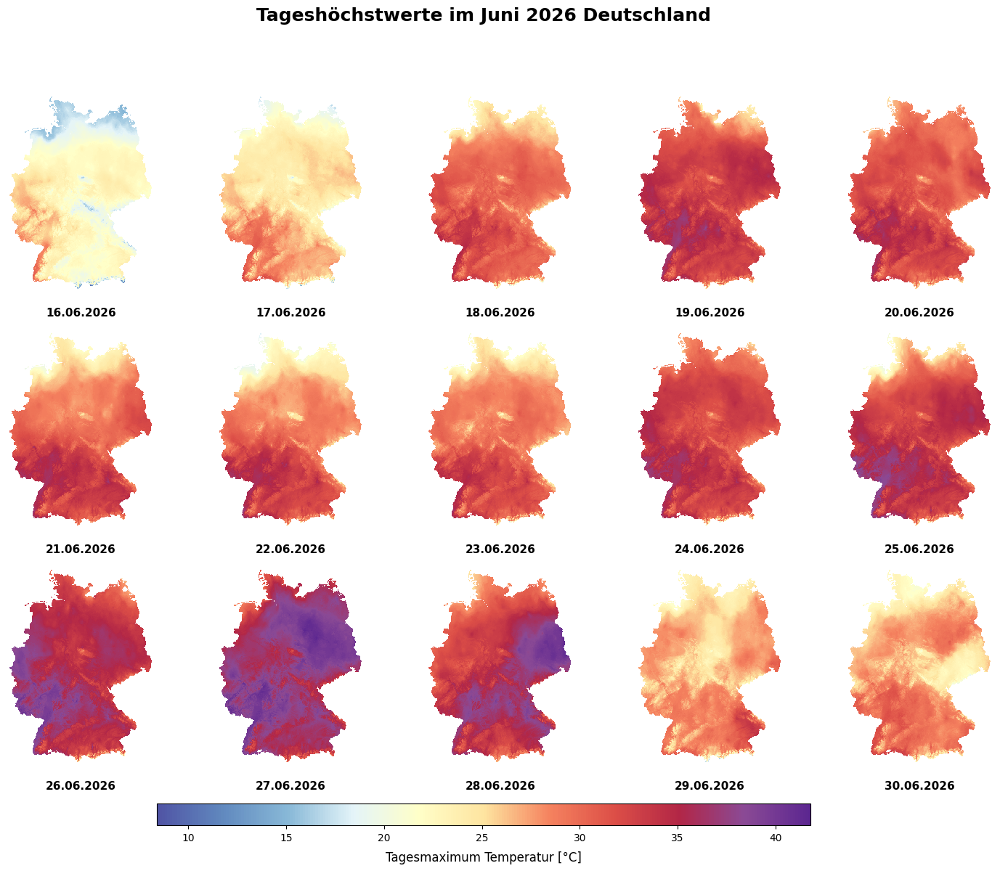

# Regional Climate Time Series from DWD Raster Data

This repository contains reproducible Python workflows for creating regional climate time series from gridded raster data provided by the German Weather Service (DWD).

The project uses the municipality of Kerpen, Germany, as a case study and demonstrates how national climate raster datasets can be downloaded, converted, clipped to a study area, aggregated into regional time series, and exported for further analysis.

The workflow is designed as both a technical portfolio project and a practical example for climate data analysis in a regional climate adaptation context.

---

## Project overview

The main workflow processes DWD raster data and converts it into analysis-ready regional datasets.

The workflow produces:

* clipped monthly GeoTIFF rasters for the study area over all available temporal resolutions
* a regional mean time series as CSV
* a stacked raster time series as NetCDF
* reusable outputs for follow-up visualization and analysis notebooks
* visualization of climate data as graphics and spatial plits
* 
The same workflow structure can be adapted to other DWD-CDC raster datasets, such as temperature or precipitation, by changing the dataset URL, filename pattern, value column, and unit.

---

## Case study: Kerpen and the ARKE project

This repository builds on work connected to the ARKE research project: *Adapting to the consequences of climate change for the Kolpingstadt Kerpen*.

The ARKE project focused on climate change impacts, risk analysis, and adaptation planning at the municipal scale. Kerpen is used here as a concrete study area to demonstrate how climate raster data can be transformed into regional indicators that are easier to analyze and communicate.

More information about the ARKE project is available here:

https://www.th-koeln.de/en/spatial-development-and-infrastructure-systems/arke---adapting-to-the-consequences-of-climate-change-for-the-kolpingstadt-kerpen_113290.php

Although the notebooks use Kerpen as an example, the workflow can be adapted to other municipalities or regions in Germany.

---

## Visualizations

